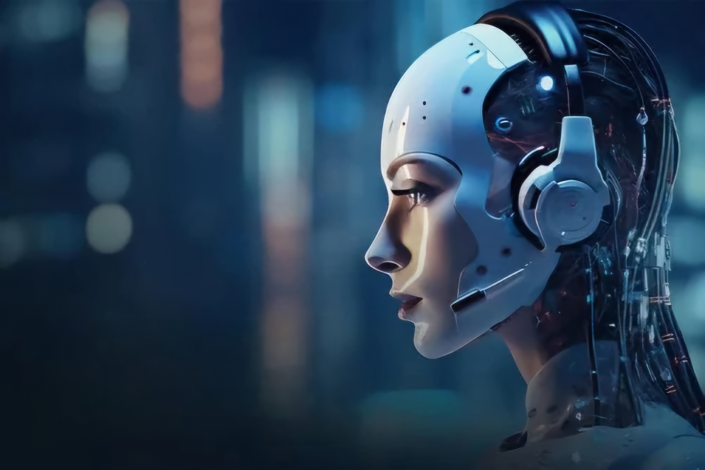

# 📲 AI Calling Agent
An AI-powered calling agent for automatic conversation with users in natural language!

## There are two versions of our conversational phone agent:
### 1. [Standalone Version](standalone/README.md)
### 2. [Phone Agent Version](phone_agent/README.md)

---

## 💡 Creators

This project was developed by:

- **Arunangshu Karmakar**  
     
  Undergraduate Student, Department of Mathematics, IIT Kharagpur  

- **Aditya Debnath**  
     
  Undergraduate Student, Department of Electrical Engineering, IIT Kharagpur  

- **Soumyashree Nayak**  
     
  Undergraduate Student, Department of Chemical Engineering, IIT Kharagpur  

- **Aiswani Mondal**  
     
  Undergraduate Student, Department of Electrical Engineering, IIT Kharagpur  
