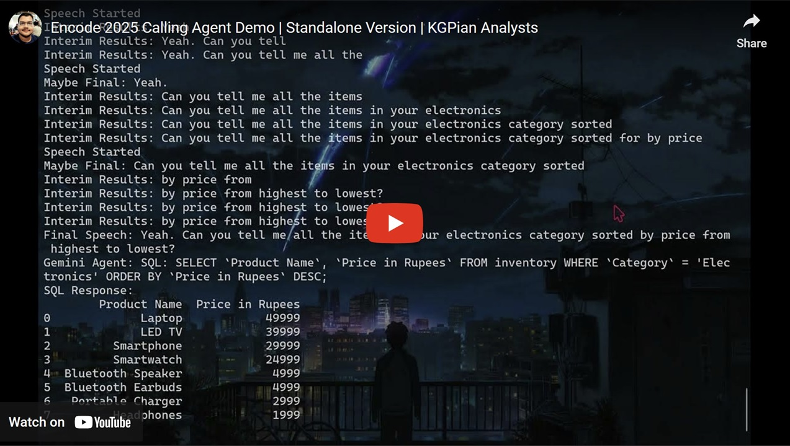

# 🤖 AI Callbot (Standalone Version)


This code integrates speech-to-text, text-to-speech, and customer service automation using APIs and local resources.\
**[Jump to Usage Guide](#-how-to-use)**

---

## 📑 Table of Contents
- [Demo Video](#-demo-video)
- [Features](#-features)
- [Overview](#-overview)
- [How to Use](#-how-to-use)
- [Updating the Database and Initial Prompt](#️-updating-the-database-and-initial-prompt)
- [Troubleshooting](#️-troubleshooting)
- [Acknowledgements](#-acknowledgments)

---

## 🎥 Demo Video
[](https://www.youtube.com/watch?v=HA0ScCus5yU)

---

## ✨ Features
- 🎙️ **Real-Time Voice Interaction**: Speak into your microphone to interact with the AI agent.
- 🤖 **AI-Powered Responses**: Uses Google's Generative AI for intelligent, conversational replies.
- 📊 **Dynamic Database Queries**: Queries an in-memory SQLite database for product information.
- 🔊 **Audio Feedback**: Converts responses into synthesized speech for a seamless voice experience.
- 🔄 **Customizable Use Case**: Easily modify the chatbot's behavior and database to suit different domains.

---

## 👀 Overview
This project is a real-time, voice-based customer interaction system that combines advanced AI, speech-to-text, text-to-speech, and database management technologies. It leverages Deepgram's API for accurate transcription and speech synthesis and Google Generative AI (Gemini) to provide intelligent and context-aware responses. Designed for versatility, the app can handle a variety of use cases, from customer service to domain-specific virtual assistants, with dynamic database integration for personalized and precise interactions. The system is easy to configure, scalable, and offers a seamless way to interact with users through natural, conversational speech.

### Core Functionality:
1. **Environment Setup:**
   - It uses `.env` files to store sensitive information like API keys.
   - Imports multiple libraries for audio processing, database management, and API interaction.

2. **Speech-to-Text (Deepgram):**
   - Captures live audio using `PyAudio`.
   - Streams audio to the Deepgram API for transcription in real-time.
   - Processes final transcriptions when detected and sends them for further action.

3. **Generative AI (Google's Gemini Model):**
   - Configures a customer service chatbot (`GeminiPhoneAgent`) to respond to queries.
   - Uses predefined instructions to simulate professional phone agent behavior, including querying a local database (`SQLite`) when relevant.

4. **Text-to-Speech:**
   - Converts chatbot responses into audio using Deepgram's text-to-speech API.
   - Plays the generated audio back to the user.

5. **Database Integration:**
   - Loads product inventory data into an in-memory SQLite database.
   - Responds to product queries by dynamically constructing SQL queries and processing the responses.

6. **Conversation Flow:**
   - The system starts with a greeting and processes user speech.
   - Uses the Gemini chatbot to respond based on input, including querying the database when necessary.
   - Synthesizes the chatbot's response into audio and plays it back.

7. **Event Handling:**
   - Manages various events like speech detection, metadata updates, and errors during live transcription and streaming.

8. **Exit Handling:**
   - Detects when the customer is satisfied (`EXIT` keyword) and terminates the conversation.

### High-Level Use Case:
This script is for a **customer service application** where:
- Customers interact via voice.
- Queries are transcribed, processed, and answered using a combination of AI and database querying.
- Responses are played back in real-time, providing an interactive, voice-based service experience.

### Tools and APIs Used:
- **Deepgram**: For speech-to-text and text-to-speech.
- **Google Generative AI (Gemini)**: To simulate the chatbot's intelligence.
- **SQLite**: For querying inventory data locally.
- **PyAudio**: For live audio capture.
- **Pydub**: For audio playback.

It is effectively a virtual customer service agent capable of real-time, dynamic responses driven by voice input and integrated systems.

---

## 🤔 How to Use

Follow the steps below to set up and run the app on your system:

### 1. Prerequisites
Ensure you have the following installed on your system:
- **Python 3.8+**
- A package manager like `pip`
- **Git and Github CLI**: For cloning the repository. If you don’t have it, <a href="https://git-scm.com/" target="_blank">download Git here</a> and <a href="https://cli.github.com/" target="_blank">download and install Github CLI here</a> and set it up using `gh auth login`.

### 2. Clone the Repository
```bash
gh repo clone arunangshu/ai-calling-agent
cd ai-calling-agent
cd standalone
```

Alternately, you can <a href="https://github.com/arunangshu/ai-calling-agent/archive/refs/heads/main.zip" target="_blank">download the repository as zip</a>, extract it and open the folder `standalone`. Then right-click inside the folder in an empty area and click on `Open in Terminal`.

### 3. Install Dependencies
Install the necessary Python libraries using the following command:
```bash
pip install -r requirements.txt
```

If the `requirements.txt` file is not available, you can manually install the libraries by running:
```bash
pip install python-dotenv pyaudio google-generativeai deepgram-sdk pydub pandas audioop-lts
```

### 4. Installing FFmpeg

The application uses `pydub`, which relies on **FFmpeg** for audio processing tasks. Follow the steps below to install and configure FFmpeg on your system:

#### **Step 1: Download FFmpeg**
- Visit the [official FFmpeg website](https://ffmpeg.org/download.html).
- Choose the version for your operating system:
  - **Windows**: Download a precompiled binary from a trusted source like [Gyan.dev](https://www.gyan.dev/ffmpeg/builds/) OR Install FFmpeg via winget:
   ```bash
   winget install ffmpeg
   ```
   Restart the terminal after installation.
  - **macOS**: Install FFmpeg via Homebrew:
    ```bash
    brew install ffmpeg
    ```
  - **Linux**: Use your package manager (e.g., `apt`, `yum`, or `dnf`):
    ```bash
    sudo apt update
    sudo apt install ffmpeg
    ```

#### **Step 2: Add FFmpeg to Your PATH**
Follow this step only if running `ffmpeg -version` in the terminal shows that FFmpeg is not installed or recognised.\
To ensure FFmpeg works from any directory, add it to your system's PATH.

- **Windows**:
  1. Extract the FFmpeg ZIP file.
  2. Copy the path to the `bin` folder (e.g., `C:\ffmpeg\bin`).
  3. Add the path to the System Environment Variables:
     - Open **System Properties** > **Advanced** > **Environment Variables**.
     - Under "System variables," find `Path` and click **Edit**.
     - Add the FFmpeg `bin` folder path.
  4. Restart your terminal or system to apply changes.

- **macOS/Linux**:
  Add FFmpeg to your PATH by editing your shell configuration file (e.g., `.bashrc` or `.zshrc`):
  ```bash
  export PATH="$PATH:/path/to/ffmpeg/bin"
  ```
  Replace `/path/to/ffmpeg/bin` with the actual FFmpeg `bin` folder path.

#### **Step 3: Verify Installation**
Run the following command in your terminal or command prompt:
```bash
ffmpeg -version
```

You should see the version details of FFmpeg. For example:
```
ffmpeg version 5.1.2 Copyright (c) 2000-2023 the FFmpeg developers
built with gcc 9.4.0
```

#### **Step 4: Test Audio Processing**
Run the application again to confirm FFmpeg is working correctly with `pydub`.

### 5. Ensure Required Files
Ensure the following files are present in the `standalone` folder:
- `Encode.py`
- `Products.csv`
- `start_audio.mp3`

If not already present, download them from this repository and place them in the folder.

### 6. Obtain API Keys
_Follow the steps given in this section if you don't have the API keys._\
You will need API keys for:

#### **Deepgram API**: For speech-to-text and text-to-speech.
##### If you already have a Deepgram account:
1. Go to <a href="https://console.deepgram.com/login" target="_blank">Deepgram Console Log In</a>.
2. Login to your account.
3. Click on `API Keys` on the left pane.
4. Click on `Create a New API Key`.
5. Give a name for your API Key.
6. Click on `Create Key`.
7. Copy this secret API Key and save it somewhere safe. You will not be able to see the API key on the website again. If you lose the key, you will have to create a new one.

##### If you do not have a Deepgram account:
1. Go to <a href="https://console.deepgram.com/signup" target="_blank">Deepgram Console Sign Up</a>.
2. Click on `Sign up with Google` for ease.
3. Select your preferred Google Account and your account will be created.
4. Click on `Create API Key`.
5. Give a name for your API Key.
6. Click on `Create Key`.
7. Copy this secret API Key and save it somewhere safe. You will not be able to see the API key on the website again. If you lose the key, you will have to create a new one.

#### **Google Generative AI**: For chatbot functionality.
1. Go to <a href="https://aistudio.google.com/apikey" target="_blank">Google AI Studio > Get API Key</a>.
2. Click on `Create API Key`.
3. Click on the Search Bar and select `Gemini API`.
4. Click on `Create API key in existing project`.
5. Copy the API key and save it somewhere. Keep it secret.

### 7. Set Up the `.env` File
Create a file named `.env` in the root directory and open it using any text editor. Set up your API keys by writing them in the following format inside the file:
```plaintext
DEEPGRAM_API_KEY=<your_deepgram_api_key>
GOOGLE_API_KEY=<your_google_api_key>
```

Replace `<your_deepgram_api_key>` and `<your_google_api_key>` with your actual keys and save the file.

### 8. Run the Application
Execute the `Encode.py` script to start the application:
```bash
python Encode.py
```

Alternately, you can directly open the `Encode.py` file using Python.

### 9. Interact with the Application
- Wait for some time.
- When prompted, speak into your microphone to interact with the app.
- The app will transcribe your input, process it using the chatbot, and respond with synthesized speech.
- Follow the prompts to complete your session.

### 10. Exit the Application
When your conversation ends, the chatbot automatically concludes with an `EXIT` command and the program closes.\
Alternately, press `Ctrl+C` to manually terminate it.

---

## ⚙️ Updating the Database and Initial Prompt
As your application evolves, you may need to update its functionality to cater to different use cases or datasets. For instance, you might want to change the chatbot's behavior to handle a new domain, such as healthcare, education, or retail, or replace the product inventory database with a new dataset. This section provides a comprehensive guide on how to update the database with a new CSV file and modify the initial prompt in the code to adapt the chatbot’s role and functionality to a new use case.

### 1. **Updating the Database**

The database is loaded from a CSV file (`Products.csv`) into an in-memory SQLite database. To update the database with a new CSV file, follow these steps:

#### Step 1.1: Prepare the New CSV File
- If you just need to update the product details, the new CSV file follows the same structure as `Products.csv`:
  ```plaintext
  Product Name,Category,Brand,Price in Rupees,Stock,Description
  ```
- If the structure differs, you must adjust the `Encode.py` script to reflect the new schema.

#### Step 1.2: Replace the CSV File
- Replace the existing `Products.csv` file in the project directory with your new file.
- Name your new file `Products.csv`, or update the filename in the `Encode.py` script where the CSV is loaded:
  ```python
  df = pd.read_csv('Products.csv')  # Replace 'Products.csv' with the new filename
  ```

#### Step 1.3: Test the Database Loading
- Run the script to verify that the new data is loaded correctly. Look for the message `Database loaded!` in the console output.

---

### 2. **Updating the Initial Prompt**

The initial prompt defines the chatbot's behavior and use case. To change it:

#### Step 2.1: Locate the Prompt
In the `Encode.py` script, find the `initial_prompt` variable in the `initialize_chat` method:
```python
initial_prompt = """
You are a professional phone agent for a customer service department...
"""
```

#### Step 2.2: Modify the Prompt
Replace the text inside the triple quotes with a new use case. Remember to state the columns and give it the first few rows. Also precisely mention how you want the conversation agent to respond.

### 3. **Testing the Changes**

#### Step 3.1: Verify Database Integration
- Run the script and test a few queries to ensure the database is correctly loaded and functional.

#### Step 3.2: Validate the New Prompt
- Interact with the chatbot to confirm it behaves as expected according to the new prompt.

#### Step 3.3: Debug Issues
- If there are errors or unexpected behavior, check the database schema, the prompt logic, and any adjustments made in the code.

---

### ⚠️ Troubleshooting
- **Microphone Issues**: Ensure your microphone is connected and properly configured. Check your system's audio input settings.
- **API Errors**: Double-check your `.env` file for correct API keys.
- **Dependencies**: If you encounter errors about missing packages, ensure all dependencies are installed correctly.
- **Missing Files**: Verify that `Products.csv` and `start_audio.mp3` are in the root directory.
- **FFmpeg Not Found Error**: Ensure FFmpeg is correctly added to your system's PATH. Test FFmpeg using `ffmpeg -version` to confirm it is installed. If the issue persists, try reinstalling FFmpeg and restarting your terminal.

---

## 🙌 Acknowledgments
- **Deepgram**: For Speech-to-Text and Text-to-Speech APIs.
- **Google Generative AI**: For creating intelligent conversations.
- **SQLite**: For database querying and management.
- **FFmpeg**: For seamless audio processing.
- **Pydub**: For handling and playing audio files.

---

Happy AI Calling! 🚀📞